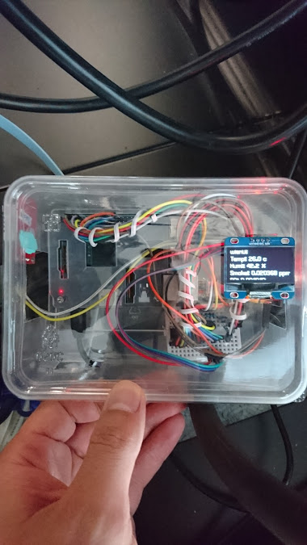
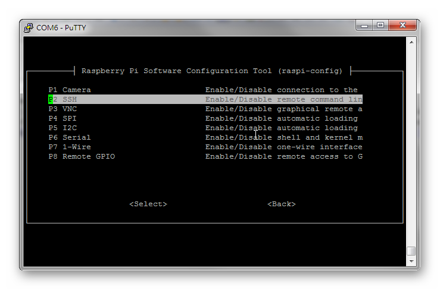
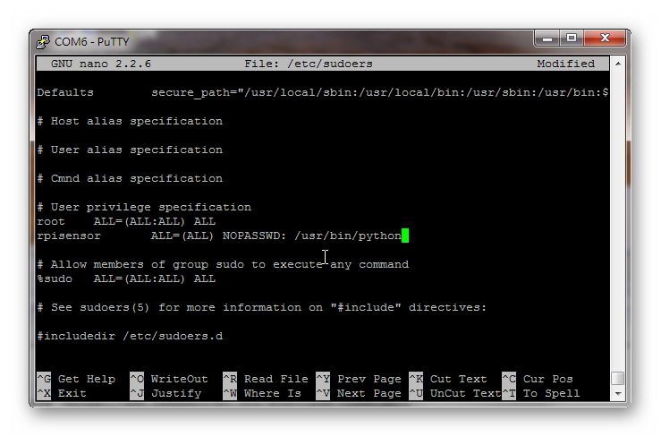
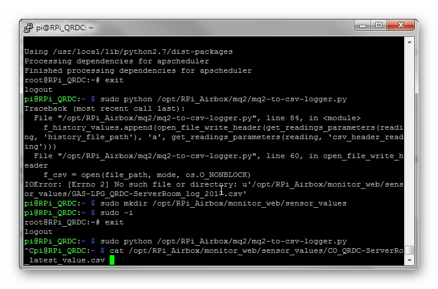
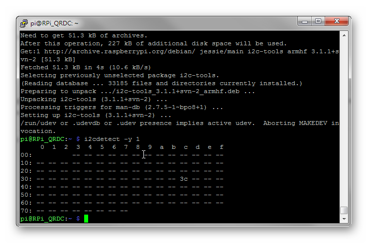
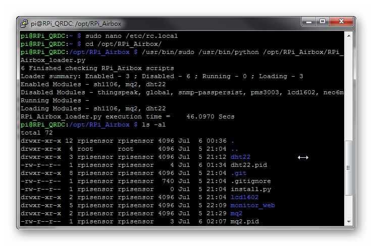

# 樹莓派空氣盒子-DHT22, MQ2, SH1106



## 1. 初始化樹莓派(簡稱︰RPi)

**i) 自樹莓派官方網頁下載Raspbian影像檔**
(https://www.raspberrypi.org/downloads/raspbian/)

**ii) 下載Windows燒錄SD程式 -DiskImager**
(https://sourceforge.net/projects/win32diskimager/)

**iii) 將影像檔燒錄至MicroSD上**

**iv) 掛載MicroSD /boot分割區到Windows/Linux/MAC上**
 將下列指令加到*config.txt*的最後一行將Raspberry Pi 3上的UART開啟
```
dtoverlay=pi3-disable-bt
```

**v) 自PC連結TTL轉USB的線至樹莓派** 
- 黑線(GND) => Pin 6
- 白線(UART Rx) => Pin 8
- 綠線(UART Tx) => Pin 10

**vi) 以預設帳號(pi/raspberr)登入樹莓派console**
輸入下列指令進行基本設定︰
```
$ sudo raspi-config
```
需進行下列設定︰
- Change User Password => 修改預設帳號pi的密碼
- Hostname => 修改此台樹莓派的電腦名稱
- Localisation Options => Change Timezone => 修改時區
- Interfacing Options => SSH, SPI, I2C, Serial => 皆修改為Enable


完成後輸入以下指令重開機︰
```
$ sudo reboot
```

**vii) 建立系統帳號 - rpisensor作為之後執行所有RPi_Airbox程式之用**
依序輸入下列指令，以建立此帳號並給予對應界面之存取權限。
```
$ sudo useradd -r rpisensor
$ sudo mkhomedir_helper rpisensor
$ sudo usermod -aG dialout,gpio,i2c,spi rpisensor
```

**viii) 修改/etc/sudoers設定，讓rpisensor帳號在啟動其他python程式時，無需另外輸入sudo密碼**
輸入下列指令，對/etc/sudoers進行修改
```
$ sudo nano /etc/sudoers
```
於帳號設定處，新增底下這行。
```
rpisensor       ALL=(ALL) NOPASSWD: /usr/bin/python
```


註︰存檔前務必確認無輸入錯誤，此檔案格式錯誤會造成一般使用者無法執行sudo指令，之後要復原會非常麻煩。

**ix) 安裝必要套件**
```
$ sudo apt-get update
$ sudo apt-get install -y build-essential python-dev python-pip ntpdate git
$ sudo -H pip install --upgrade pip
$ sudo -H pip install psutil
```

**x) 若所在的網路環境必須透過proxy連Internet，請注意以下指令對應的proxy設定**
```
- apt-get => /etc/apt/apt.conf.d
- git => sudo git config --global http.proxy [your proxy]
         sudo git config --global https.proxy [your proxy]
- pip => export https_proxy=[your proxy]
         sudo -E pip install [module]           # 後續安裝之指令
```

**xi) 自Github取得此專案程式**
```
$ cd /opt
$ sudo git clone https://github.com/Freeman3389/RPi_Airbox.git
```

**xii) 確認RPi_Airbox設定檔案settings.json**
```
$ sudo nano /opt/RPi_Airbox/settings.json
```

檢查 *global*中的設定，*sensor_location*記得修改。
檢查樹莓派所使用的硬體/Sensor所對應的Module設定，
記得有使用的模組務必將*status*設定成*1*，之後loader才會自動載入執行。


**xiii) 建立monitor_web\sensor_values資料夾儲存資料**
```
$ sudo mkdir /opt/RPi_Airbox/monitor_web/sensor_values
```

**xiv) NTP伺服器校時（若網路許可）**
```
$ sudo systemctl stop ntp
$ sudo ntpdate -s [your NTP server]
```

## 2. 設定DHT22溫濕度感測器(GPIO)
進行此小節前，必須先將DHT22正確接線到樹莓派，並確認DHT22資料腳接到樹莓派的那個針腳上。

**i) 切換到/opt/RPi_Airbox/dht22目錄**
```
& cd /opt/RPi_Airbox/dht22
```

**ii) 下載DHT22 Library至此目錄**
```
$ sudo git clone https://github.com/adafruit/Adafruit_Python_DHT.git
$ cd Adafruit_Python_DHT
$ sudo python setup.py install
```

完成後，可以執行以下程式進行測試。請注意，此處是以GPIO針腳編號，非BCM針腳編號。

```
examples/AdafruitDHT.py 2302 [GPIO Pin #]
```
若能看到類似*"Temp=26.3*  *Humidity=44.1%"*的結果，表示DHT22正常工作中。

**iii) 確認setting.json**
- *gpio_pin* 需依接線方式修改，此處預設為'4'
- *DHT22*對應的*status*設定為*1*

## 3. 設定MQ2偵煙偵測器(透過類比數位轉換晶片-ADC-接上GPIO)
在進行此小節前，必須先行將接線正確完成，同時請確認MQ2的Analog資料腳接到ADC的那個Channel（接腳）。


若不是很了解的話，請參考以下網頁︰
(https://tutorials-raspberrypi.com/configure-and-read-out-the-raspberry-pi-gas-sensor-mq-x/)

**i) 安裝必要的python模組**
```
$ sudo -H pip install spidev
$ sudo -H pip install apscheduler
$ sudo -H pip install setuptools
$ sudo -H pip install tzlocal
```

**ii) 檢查setting.json設定**
- *mq2*中的*mq_channel*必須與實際接上的ADC channel一致
- *mq2* 的*status*設定為*1*

**iii) 測試MQ2能否正常運作**
```
$ sudo python /opt/RPi_Airbox/mq2/mq2-to-csv-logger.py &
```
執行後請稍等5分鐘，再執行以下指令檢查是否有數值。
```
$ cat /opt/RPi_Airbox/monitor_web/sensor_values/CO_QRDC-ServerRo_latest_value.csv
```
若能在輸出的第二行看到數值，則表示MQ2運作正常。

**測試完成後，別忘了清理測試資料**
```
$ sudo rm -rf /opt/RPi_Airbox/monitor_web/sensor_values/*.csv
```

## 4. 設定SH1106 OLED螢幕(I2C)
進行此小節前，請完成所有接線，不清楚該怎麼接線的話，可以參考以下網頁︰
(https://luma-oled.readthedocs.io/en/latest/)
此專案的設計是由感測器收到資料時，寫到指定的目錄的csv格式檔案中，
再由資料呈現模組抓取csv檔案中的數值呈現。
因此在剛設定好時，這些作為資料呈現用的模組可能測試時會出現找不到檔案的錯誤訊息。


**i) 安裝必要套件**
```
$ sudo apt-get install -y i2c-tools python-smbus libfreetype6-dev libjpeg-dev
$ sudo pip -H install --upgrade pip
$ sudo apt-get purge python-pip
$ sudo pip -H install --upgrade luma.oled
```
安裝完成後，再輸入以下指令確認SH1106的port以及address。
註︰指令最後的數字表示i2c_port，除非是很老舊的樹莓派是0，其他的多數都是1  
```
$ i2cdetect -y 1
```


**ii) 修改settings.json中SH1106的部份**
- "i2c_port" => "1"                         # 預設值為1
- "i2c_address" => "[SH1106 address]"       # 依上述偵測設置，一般來說會是0x3C
- "device_height" => "64"                   # 預設值，仍需確認硬體規格書
- "status" => "1"

## 5. 設定snmp-passpersist
如同SH1106，剛安裝好的樹莓派，因為可能還沒有產生有放資料的CSV，所以測試時可能會有錯誤訊息產生。
**因為此python程式會由snmpd來呼叫，故settings.json中的 *status*請務必保持預設值 *“0”***

**i) 安裝必要套件**
```
$ sudo pip -H install snmp-passpersist
$ sudo apt-get install -y snmpd
```

**ii) 修改snmpd設定檔/etc/snmp/snmpd.conf**
若不曉得如何修改，可以參考snmp-passpersist目錄下的設定範本，但底下這行務必依所在環境修改。
```
rocommunity public  192.168.1.0/24 -V all
=>
rocommiuity [your ro community] [your NMS server] -V all
```

**iii) 修改settings.json設定**
修改 *"snmp-passpersist"*模組中*"sensor-readings-list"*的陣列，每個感應器名稱務必與產生資料的感測器完全相同，
否則會抓不到對應的csv檔案，造成找不到檔案的錯誤訊息。

**iv) 將系統帳號 snmp 加到rpisensor群組**
因為snmp-passpersist-upload.py的所有者與snmpd執行的系統帳號不同，故需以此方式確保snmpd能正常執行此程式。
```
$ sudo usermod -aG snmp rpisensor
```

**v) 重啟snmpd以套用設定**
```
$ sudo service snmpd restart
```
重啟完成後，可以利用以下指令確認snmpd的執行狀況。
```
$ sudo service snmpd status
$ netstat -ln
$ tail -f /var/log/syslog | grep snmp
```

## 6. 設定開機自動執行以及定時排程檢查任務

**i) 修改"/opt/RPi_Airbox"的所有者為rpisensor**
```
$ sudo chown -R rpisensor:rpisensor /opt/RPi_Airbox
```

**ii) 測試載入程式是否能正常執行**
```
$ cd /opt/RPi_Airbox
$ /usr/bin/sudo /usr/bin/python /opt/RPi_Airbox/RPi_Airbox_loader.py
```
若能在執行完成後看到以下畫面，則表示執行成功。
```
Finished checking RPi_Aribox scripts
Loader summary: Enabled - 3 ; Disabled - 6 ; Running - 0 ; Loading - 3
Enabled Modules - sh1106, mq2, dht22
Disabled Modules - thingspeak, global, snmp-passpersist, pms3003, lcd1602, neo6m
Running Modules -
Loading Modules - sh1106, mq2, dht22
RPi_Airbox_loader.py execution time =    46.0970 Secs
```

**iii) 修改開機啟動設定檔/etc/rc.local**
```
$ sudo nano /etc/rc.local
```
在最後一行*"exit 0"*之前，加上底下兩行指令。請記得修改ntp server的位置。
```
/usr/bin/sudo /usr/bin/python /opt/RPi_Airbox/RPi_Airbox_loader.py >/dev/null 2>&1
/usr/bin/sudo ntpdate -s [your NTP server] >/dev/null 2>&1
```

**iv) 建立定時檢查所有模組程式之排程**
```
$ sudo crontab -e
```
加入以下兩行程式，之後每小時的半點會呼叫載入程式進行檢查，每小時的整點則會進行校時。
```
30 * * * * /usr/bin/sudo /usr/bin/python /opt/RPi_Airbox/RPi_Airbox_loader.py >/dev/null 2>&1
0 * * * * /usr/bin/sudo ntpdate -s [your ntp server] >/dev/null 2>&1
```

## 恭喜，大功告成。
	
